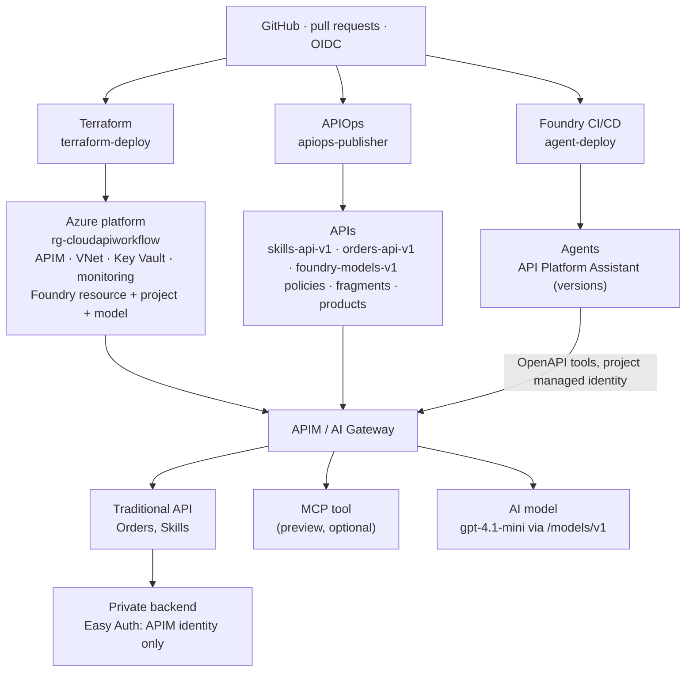
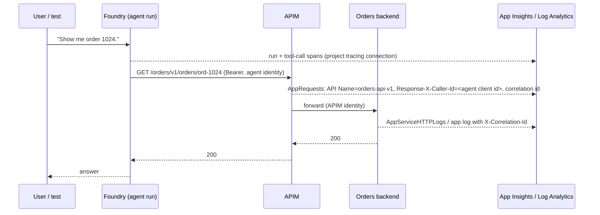

# Agentic architecture

The platform grew from "APIs through one gateway" to "APIs, agents, models
and tools through one gateway" without adding a gateway, a repository or a
new kind of pipeline. Three lifecycles, one governance layer.

## Final architecture



## Three lifecycles

| lifecycle | tool | owns | trigger |
|---|---|---|---|
| platform | Terraform | Foundry resource, project, model deployment, identities, RBAC, tracing connection, network | `terraform/**` PR → `terraform-deploy` |
| API | APIOps | `apim/artifacts` including the model API and AI policy fragments | `apim/**` PR → `apiops-publisher` |
| agent | Foundry CI/CD (`azure-ai-projects` SDK) | `agents/<name>/` definition, instructions, tools, tests | `agents/**` PR → `agent-deploy` |

None of them can do another's job: Terraform never creates agents or APIs,
APIOps cannot create Foundry resources, the agent deployer has no rights on
APIM or Azure resources beyond the Foundry account.

## The agent

`API Platform Assistant` (`agents/api-platform-assistant/`) is a
`PromptAgentDefinition`: a model, instructions, and two OpenAPI tools. The
tools are built at deploy time from the **same OpenAPI documents APIOps
publishes**, filtered to a read-only operation allow-list, with the gateway
URL injected as the only server and Foundry's managed-identity auth pointed
at the platform audience. The definition in Git contains no hostname and no
credential; `agent-ci` fails if one appears.

Each deployment creates a new agent **version** (metadata records the git
commit). Rollback is redeploying the previous commit.

```text
User: "Show me order 1024."
  1. agent decides orders_api.getOrder(orderId="ord-1024")
  2. Foundry acquires a token for api://<tenant>/cloudapiworkflow-<env> as the agent's own
     Entra identity (roles: Orders.Read, Skills.Read - declared in agent.yaml, granted by agent-deploy)
  3. APIM: validate-jwt → roles → rate limit → X-Correlation-Id, X-Caller-Id=<agent client id>
  4. APIM → Orders backend with APIM's managed identity (Easy Auth allows only APIM)
  5. answer: "Order ord-1024 for cust-7 is shipped, total 499.00 USD."
```

## Tool governance: why the agent cannot bypass the gateway

1. Tool definitions reference published contracts (`apim/artifacts/apis/<api>/specification.yaml`) by path, never by URL; the server URL is the gateway, injected at deploy time.
2. `agent-ci` rejects hosts, URLs, `azurewebsites.net`, IP addresses and credential-looking strings anywhere in the definition.
3. The agent identity holds only the roles its definition declares, and `governance/agent-roles.yaml` (platform-owned) bounds what can be declared; a write operation in a tool needs an explicit `allowWrites: true` and review.
4. Even a rogue definition that names the backend directly fails: the backend accepts tokens only from APIM's identity. `agent-deploy` proves this every run with the security test (a throwaway agent pointed at the backend gets no data, then is deleted).
5. The agent has no APIM subscription key and no model key; there is nothing to leak.

## Governing agent traffic with the same platform

No agent-specific policy exists. The agent's tool calls are indistinguishable
from an application's calls except for the `azp` claim, which the global
policy records as `X-Caller-Id`. Rate limits, roles, correlation and error
shape apply unchanged. Adding a second agent is a Terraform role grant and a
folder; adding a second API to an agent is a tool file.

## Observability of an agent transaction



The end-to-end test asserts the answer, the presence of a tool call in the
response output, and an `AppRequests` row for `orders-api-v1` from the
agent's client id with status 200 within the test window. Token usage for
model calls through the gateway appears as `cloudapiworkflow.ai` custom
metrics; agent-runtime token usage appears in the Foundry resource's
diagnostic logs. Prompts and tool payloads are not recorded by APIM (body
bytes 0); Foundry content recording is left off.

Useful queries:

```kusto
// agent traffic by API in the last day
AppRequests
| where TimeGenerated > ago(1d) and tostring(Properties["Response-X-Caller-Id"]) == "<agent client id>"
| summarize count(), p95 = percentile(DurationMs, 95) by api = tostring(Properties["API Name"]), ResultCode
```

```kusto
// token consumption through the gateway, by caller
customMetrics
| where name startswith "cloudapiworkflow.ai" or name in ("Prompt Tokens", "Completion Tokens", "Total Tokens")
| summarize tokens = sum(valueSum) by name, caller = tostring(customDimensions["Caller"]), bin(timestamp, 1h)
```

## MCP option (preview)

To expose Orders as an MCP server: add an MCP export artifact for
`orders-api-v1` in `apim/artifacts` (APIM MCP server, preview), and replace
the OpenAPI tool with an `MCPTool` whose `server_url` is the gateway's MCP
endpoint and whose `allowed_tools` lists `getOrder` and `listOrders`.
Authentication stays Entra (managed identity); the gateway's policies still
apply. The core demo does not depend on it.

## Multi-team operating model

```text
                 PLATFORM ENGINEERING
   Terraform · APIM · AI Gateway standards · network · identity baseline
   shared policies & fragments · observability standards · guardrails (CI)
                          |  paved road
        +-----------------+-----------------+
        |                 |                 |
     API team          AI team          App team
   OpenAPI contract   agent definition   client application
   API policy         instructions       user sign-in, calls APIs / agents
   backend code       tool selection
   apis/<name>        agents/<name>      (outside this repo)
        \                 |                 /
                    GitHub pull requests
              api-validation · agent-ci · terraform-ci
```

| who | owns | cannot |
|---|---|---|
| platform engineering | `terraform/`, `apim/artifacts/policy.xml`, products, fragments, `.github/`, `scripts/` | write API contracts or agent instructions for teams |
| API teams | `apim/artifacts/apis/<api>/`, `applications/<api>/` | change global policy, fragments, identity |
| AI teams | `agents/<name>/` | reference anything but published contracts; grant themselves roles |
| app teams | client applications | obtain agent or backend identities |

## Production changes

Private endpoint and network injection for Foundry; one project (and
identity) per AI team; content safety on model APIs; backend pools for
models; PTU where latency matters; Defender for AI; evaluation runs in
`agent-ci` against a golden prompt set; a change-management gate on
instructions (production environment reviewers already apply to
`agent-deploy` with `environment: production`); prompt and tool-output
retention policies agreed with security.
