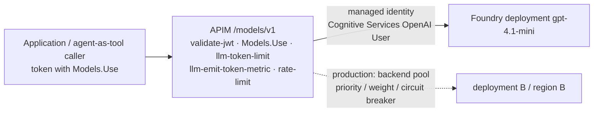

# APIM as the AI Gateway

The existing API Management instance is reused, unchanged as a resource, as
the governance layer for four workload types. Nothing here is a second
gateway or a second instance: AI governance is a set of APIOps artifacts
(one API, two policy fragments, one named value) published like any other.

## What the gateway governs, and how

| workload | how it reaches APIM | what APIM enforces | direct gateway support or architectural integration |
|---|---|---|---|
| **Traditional APIs** (Skills, Orders) | applications and demo clients with Entra tokens | `validate-jwt`, roles, `rate-limit-by-key`, correlation, caller attribution, backend managed identity | direct: APIM's core feature set |
| **Agent → API traffic** | Foundry agent OpenAPI tools with the project's managed identity | exactly the same policies as any client; the agent is just another `azp` | direct: no agent-specific policy is needed, which is the point |
| **AI models** | `foundry-models-v1` at `/models/v1` | `validate-jwt` + `Models.Use`, `llm-token-limit` (TPM + daily quota), `llm-emit-token-metric`, approved-deployment allow-list, managed identity to Foundry | direct: APIM AI Gateway policies (GA) |
| **MCP tools** | APIM MCP server export of an existing API, consumed by the agent's MCP tool | the API's own policies plus an MCP tool allow-list | preview, optional, see [MCP](#mcp-governance-optional-preview) |

Agent runtime model calls (the model the agent thinks with) run inside the
Foundry resource and do **not** traverse APIM. APIM governs models for
applications and for agents that call models *as tools*. This is a real
limitation of the current Foundry Agent Service and is stated here rather
than papered over.

## Capabilities used, with status

Status reflects Microsoft documentation as checked at implementation time
(2026-09). Re-verify before relying on a row in production.

| capability | policy / feature | status | used here |
|---|---|---|---|
| Authentication | `validate-jwt` (Entra issuer, audience) | GA | every API incl. models |
| Authorization | roles claim check → 403 | GA | every API incl. models (`Models.Use`) |
| Rate limiting | `rate-limit-by-key` | GA on Developer, Basic, Standard, Premium and v2 tiers; **not available on Consumption** (verified 2026-09-13: "Policy is not allowed in 'Consumption' sku") | classic/v2 environments; the Consumption dev gateway has no throttling |
| Token limits and quotas | `llm-token-limit` (tokens-per-minute, `token-quota` + period, prompt-token estimation) | GA on classic and v2 tiers; **rejected on Consumption** (verified 2026-09-13) | `ai-token-governance` fragment on classic/v2 environments (ai-gateway/README.md); absent from the Consumption dev tree |
| Token metrics | `llm-emit-token-metric` → App Insights custom metrics, dimensioned by caller | GA, accepted on Consumption (verified 2026-09-13) | `ai-observability` fragment |
| Model routing / load balancing | backends + backend pool with priority/weight and circuit breaker | GA | documented as the multi-model extension |
| Semantic caching | `llm-semantic-cache-lookup/store` (needs Azure Managed Redis) | GA | not deployed (cost) |
| Content safety | `llm-content-safety` (Azure AI Content Safety in front of the model) | GA on classic and v2 tiers; verify Consumption | documented; enable in prod tfvars |
| Backend routing | named backends + `set-backend-service` | GA | every API |
| Managed identity to backends | `authentication-managed-identity` | GA | every API incl. models |
| Logging / diagnostics | App Insights logger + per-API diagnostics, W3C correlation | GA | every API |
| Caller attribution | global policy stamps `X-Caller-Id` from the token's `azp`/`appid` | platform pattern | every request |
| MCP server export | expose an API as an MCP server from APIM | **preview** | optional artifact |
| MCP OAuth (credential manager) | APIM authorization for MCP servers | **preview** | documented only |
| Foundry model import | import a Foundry / Azure OpenAI deployment as an API | GA | done through APIOps artifacts instead of the portal wizard |

## Model governance

Centralised model access gives: one authentication model (Entra, no model
keys anywhere), per-caller token budgets that bound cost, metrics per team or
agent for chargeback, routing and failover without changing callers, and one
place to add content safety. Only the deployments listed in the policy's
allow-list are reachable; everything else is 404 at the gateway.

Multi-model routing (production): add a second deployment (another region or
a PTU deployment), declare both as backends and a backend pool in
`apim/artifacts`, and point `set-backend-service` at the pool. Callers keep
the same URL.

## MCP governance (optional, preview)

APIM can expose a REST API as an MCP server so agents call tools through the
gateway instead of a separately hosted MCP server. When enabled:

* authentication and authorization: the same `validate-jwt` and role checks as the underlying API
* rate limiting and token metrics: the same policies
* tool governance: only the operations exported are tools; the agent's MCP tool definition additionally carries `allowed_tools`
* logging: MCP calls are API calls in App Insights, attributed by caller
* network: the MCP endpoint is the gateway endpoint; backends stay private

It is not required for the demo. `docs/agentic-architecture.md` describes the
opt-in artifact and the agent tool change needed to use it.

## Policy fragments

| fragment | contents | included by |
|---|---|---|
| `ai-token-governance` (classic/v2 only) | `llm-token-limit` per caller: 2 000 TPM, 200 000 tokens/day, prompt estimation; see ai-gateway/README.md | model APIs on classic/v2 tiers |
| `ai-observability` | `llm-emit-token-metric` with caller and API dimensions | model APIs |

Fragments live in `apim/artifacts/policy fragments/` and are versioned,
reviewed and published like any policy. A new model API includes them with
two lines and inherits the platform's standards.

## Tier parity: a finding from the live run

The dev gateway runs on Consumption to keep the demo near $0. The first
publishes showed that Consumption rejects `rate-limit-by-key`, `quota-by-key`
and `llm-token-limit` outright ("Policy is not allowed in 'Consumption'
sku"), so a policy tree written for StandardV2 cannot be published to a
Consumption instance. Consequences:

* the committed tree is Consumption-compatible: no throttling or token limits in dev;
* the 429 test reports "not applicable" on Consumption and runs on classic/v2 tiers;
* an enterprise should keep the same tier family in every environment (BasicV2 in dev, StandardV2 in prod, or Developer in dev) so one artifact tree promotes unchanged. Switching dev is one tfvars value (`apim_sku_name`) and a `terraform-deploy` run.

## Scaling to dozens of APIs and agents

Every API is a folder; every agent is a folder. Products group APIs for
consumers (`internal-apis`, `agent-apis`); roles group permissions; token
quotas and rate limits are per caller, so adding agents does not change
policies. Attribution by `X-Caller-Id` makes per-agent dashboards a query.
Teams would get their own Foundry project (and therefore their own agent
identity) and their own products; the gateway, the policies and the pipelines
stay shared.
