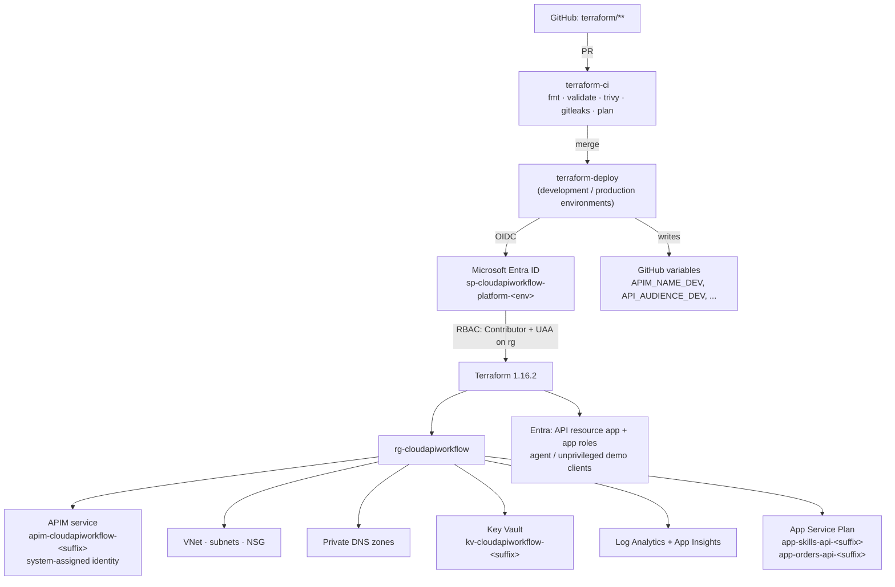
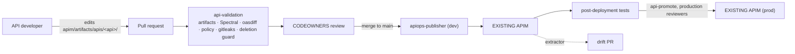
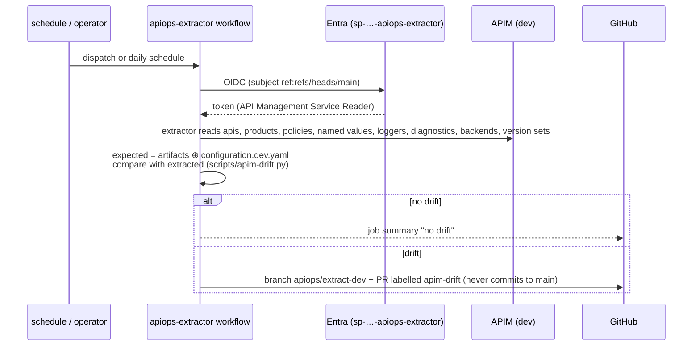
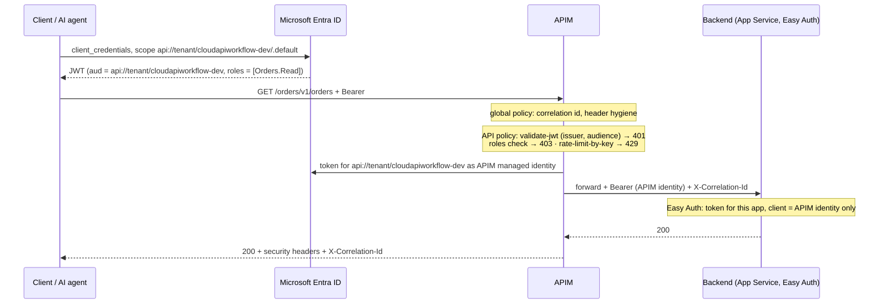
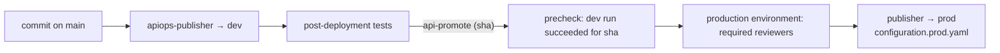
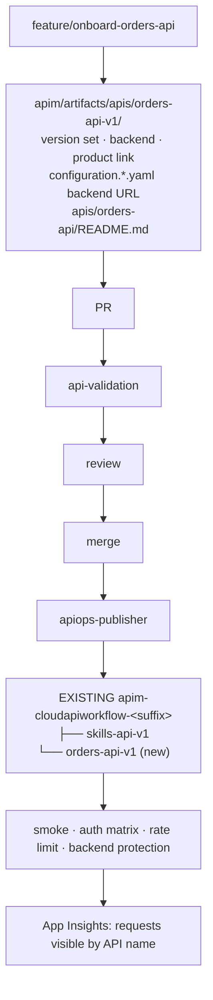

# Architecture

Two control planes over one shared API Management instance per environment:

* **Terraform** provisions the Azure platform (`rg-cloudapiworkflow` and everything long-lived).
* **Microsoft APIOps** publishes API configuration from Git into that instance.

The dividing line: if it is an ARM resource outside `Microsoft.ApiManagement/service/<name>/*`, Terraform owns it. If it is a child of the APIM service (APIs, products, policies, named values, loggers, diagnostics, version sets, backends), APIOps owns it.

## 1. Terraform platform provisioning



## 2. Terraform remote state

```mermaid
flowchart LR
    B["terraform/bootstrap<br/>(human, once)"] --> SA["stcawstate4k7m<br/>rg-cloudapiworkflow-state<br/>Entra-only auth · versioning · soft delete"]
    SA --> C1["container bootstrap<br/>bootstrap.tfstate"]
    SA --> C2["container platform<br/>dev.tfstate · prod.tfstate"]
    P1["sp-…-platform-dev"] -->|Blob Data Contributor| C2
    P2["sp-…-platform-prod"] -->|Blob Data Contributor (prod sub)| C2
    X["apiops identities"] -.->|no access| SA
```

There is no API-onboarding state: APIOps keeps no state, Git and APIM are compared directly.

## 3. APIOps lifecycle



## 4. Extractor



## 5. Publisher

```mermaid
sequenceDiagram
    participant M as main (merge)
    participant W as apiops-publisher
    participant E as Entra (sp-…-apiops-publisher)
    participant A as APIM (dev)
    M->>W: push touching apim/**
    W->>W: retirement guard (deleted APIs need label api-retirement)
    W->>E: OIDC (subject environment:development)
    E-->>W: token (API Management Service Contributor)
    W->>W: render configuration.dev.yaml from GitHub variables
    W->>A: publisher COMMIT_ID=&lt;sha&gt; (changed artifacts only, deletes honoured)
    W->>A: verify path / version / revision
    W->>A: health · 401 · 401 · 403 · 200 · 429 · backend 401
```

## 6. GitHub CI/CD

| workflow | trigger | identity | does |
|---|---|---|---|
| `terraform-ci` | PR on `terraform/**` | platform (pull_request) | fmt, validate, roots-in-sync, Trivy, gitleaks, plan + comment, critical-resource guard |
| `terraform-deploy` | push `main` on `terraform/**` | platform (environment) | apply dev, publish outputs as variables, apply prod (gated) |
| `api-validation` | every PR | none | artifacts, Spectral, oasdiff, policy, gitleaks, deletion guard |
| `apiops-publisher` | push `main` on `apim/**` | apiops-publisher + demo clients | publish dev, verify, tests |
| `api-promote` | dispatch (sha) | apiops-publisher-prod | publish the same sha to prod behind reviewers |
| `apiops-extractor` | dispatch / called | apiops-extractor | extract, compare, PR |
| `drift-detection` | daily | platform + extractor | plan → issue, extract → PR |
| `application-deploy` | push `main` on `applications/**` | platform | pytest, zip deploy, gateway health |

## 7. Runtime authentication



## 8. Private backend networking

```mermaid
flowchart LR
    I["Internet consumer"] -->|OAuth token| APIM
    I -. "direct call → 401 (dev)<br/>no route (prod)" .-> B
    subgraph VNET["vnet-cloudapiworkflow"]
        SA["snet-apim<br/>(StandardV2 outbound integration, prod)"]
        SI["snet-app-integration<br/>NSG: deny Internet inbound"]
        SP["snet-private-endpoints<br/>(prod)"]
    end
    APIM -->|managed identity token| B["app-orders-api-&lt;suffix&gt;<br/>Easy Auth allow-list = APIM identity"]
    APIM -.-> SA
    B --- SI
    B -.->|private endpoint + privatelink.azurewebsites.net| SP
    KV["Key Vault"] -.->|private endpoint (prod)| SP
```

Dev proves "cannot bypass APIM" with identity (works on Consumption). Prod adds the network layer with the same code and different tfvars.

## 9. Environment promotion



The unit of promotion is a commit SHA of `apim/artifacts`; nothing is re-authored per environment.

## 10. API onboarding lifecycle



## Policy hierarchy

```
apim/artifacts/policy.xml                         global   (platform team)
  └─ products/<product>/policy.xml               product  (API platform team)
       └─ apis/<api>/policy.xml                  API      (API team + API platform team)
            └─ apis/<api>/operations/<op>/policy.xml   operation (optional)
```

Every level begins with `<base />`; API policies carry only what differs per API.

## Naming

| resource | name |
|---|---|
| resource group | `rg-cloudapiworkflow` (fixed) |
| APIM | `apim-cloudapiworkflow-<suffix>` |
| Key Vault | `kv-cloudapiworkflow-<suffix>` |
| backend web app | `app-<api-name>-<suffix>` (tag `api=<api-name>`) |
| Entra resource app | `Cloud API Workflow APIs (<env>)`, identifier URI `api://<tenant-id>/cloudapiworkflow-<env>` |
| APIM API id | `<api-name>-v<n>` at `/<path>/v<n>`; revisions `<api-name>-v<n>;rev=<r>` |
