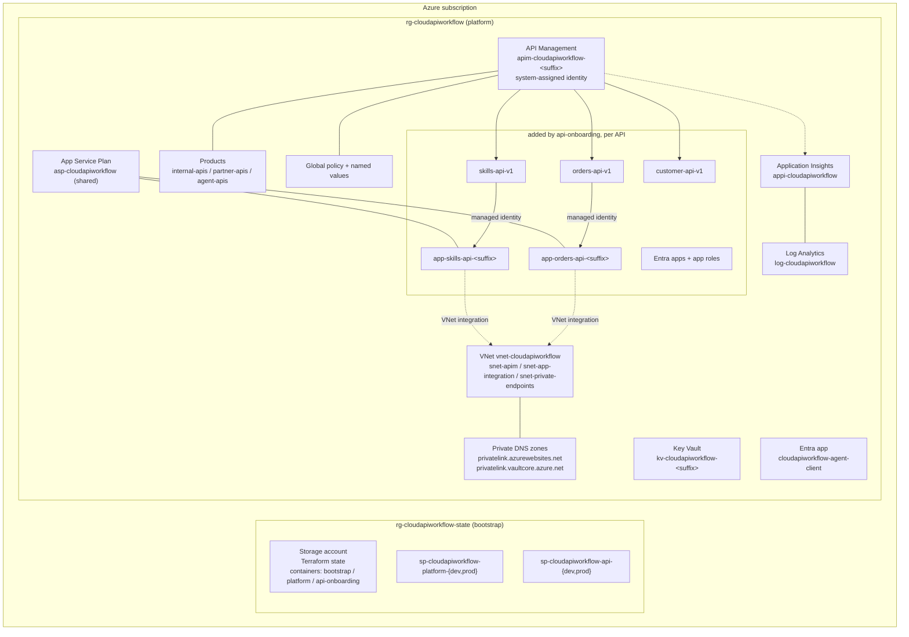
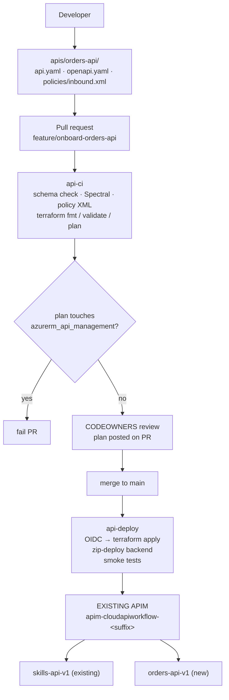
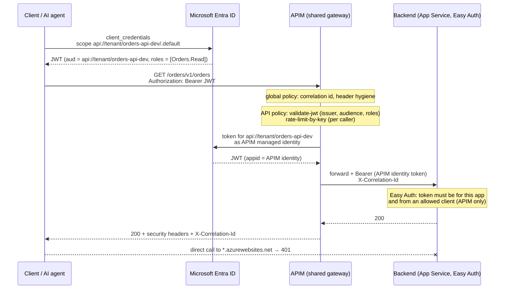

# Architecture

## Platform architecture

One shared API Management instance per environment, owned by the platform
layer. Everything an API needs at runtime (identity, logging, network, secrets)
is shared platform infrastructure; only the API definition itself is per-API.



## Two Terraform layers, three states

| Layer | Root | State key | Owns | Changes |
|---|---|---|---|---|
| bootstrap | `terraform/bootstrap` | `bootstrap/bootstrap.tfstate` | state storage, resource groups, deployer identities, RBAC | once |
| platform | `terraform/platform/<env>` | `platform/<env>.tfstate` | APIM, VNet, DNS, Key Vault, monitoring, App Service Plan, products, global policy, agent client | rarely |
| api-onboarding | `terraform/api-onboarding/<env>` | `api-onboarding/<env>.tfstate` | per API: version set, API, policy, backend, product link, diagnostic, Entra app, web app | every API PR |

The onboarding layer reads the platform through `terraform_remote_state`. The
platform exports a stable contract (`apim_name`, `apim_id`,
`apim_resource_group_name`, `apim_logger_id`, `product_ids`,
`app_service_plan_id`, ...). The onboarding root contains no
`azurerm_api_management` resource, and CI fails any plan in which the gateway
would change.

## API onboarding flow



## Runtime security



Detail in [security.md](security.md).

## Policy hierarchy

```
global   (terraform/platform/policies/global.xml)      platform team
  └─ product (terraform/platform/policies/products/*)  platform team
       └─ API (apis/<name>/policies/inbound.xml)       API team, rendered by Terraform
            └─ operation                                (not used; method checks live in the API policy)
```

Every API policy begins with `<base />`, so correlation ids, security headers
and the error shape are inherited, never copied. API policies carry only what
differs per API: audience, roles, rate limit, backend routing, mocking.

## Naming

| Resource | Name |
|---|---|
| Resource group | `rg-cloudapiworkflow` (fixed) |
| APIM | `apim-cloudapiworkflow-<suffix>` |
| Key Vault | `kv-cloudapiworkflow-<suffix>` |
| Web app | `app-<api-name>-<suffix>` |
| Entra resource app | `<Display name> (<env>)`, identifier URI `api://<tenant-id>/<api-name>-<env>` |
| APIM API | `<api-name>-<version>` at `/<path>/<version>` |

`<suffix>` is a 4-character `random_string` created once by the platform layer
and exported so the onboarding layer names web apps consistently.
