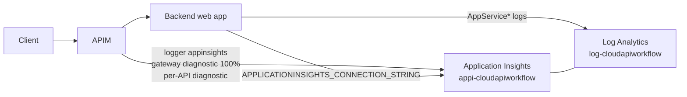

# Operations

## Observability architecture



* APIM logs every request to Application Insights with W3C correlation and the `X-Correlation-Id` request/response header (global policy mints it if the caller did not send one).
* Each API has its own `azurerm_api_management_api_diagnostic` so sampling can differ per API (`diagnostics.samplingPercentage` in `api.yaml`).
* Backend web apps ship HTTP, console, application and **authentication** logs to Log Analytics; the auth logs are where a direct-bypass attempt shows up.
* On tiers other than Consumption the gateway also writes `GatewayLogs` to Log Analytics (`azurerm_monitor_diagnostic_setting`).

Application Insights is workspace-based, so every query below runs in the
Log Analytics workspace.

## KQL

Request count, latency and status per API (last hour):

```kusto
AppRequests
| where TimeGenerated > ago(1h)
| extend api = tostring(Properties["API Name"]), op = tostring(Properties["Operation Name"])
| summarize requests = count(), p50 = percentile(DurationMs, 50), p95 = percentile(DurationMs, 95),
            errors = countif(toint(ResultCode) >= 500) by api, op
| order by requests desc
```

Backend response time vs gateway time:

```kusto
AppDependencies
| where TimeGenerated > ago(1h) and DependencyType == "HTTP"
| extend api = tostring(Properties["API Name"])
| summarize backend_p95 = percentile(DurationMs, 95), backend_failures = countif(Success == false) by api, Target
```

Authentication (401) vs authorization (403) failures:

```kusto
AppRequests
| where TimeGenerated > ago(24h) and ResultCode in ("401", "403")
| extend api = tostring(Properties["API Name"])
| summarize count() by api, ResultCode, bin(TimeGenerated, 15m)
| render timechart
```

Rate-limit events:

```kusto
AppRequests
| where TimeGenerated > ago(24h) and ResultCode == "429"
| extend api = tostring(Properties["API Name"]), caller = tostring(Properties["Request-X-MS-Client-Principal-Name"])
| summarize throttled = count() by api, bin(TimeGenerated, 5m)
```

Follow one correlation id from gateway to backend:

```kusto
let cid = "<X-Correlation-Id>";
union AppRequests, AppDependencies, AppTraces
| where TimeGenerated > ago(7d)
| where tostring(Properties["Request-X-Correlation-Id"]) == cid or tostring(Properties["Response-X-Correlation-Id"]) == cid or Message has cid
| project TimeGenerated, Type, Name, ResultCode, DurationMs, Message
| order by TimeGenerated asc
```

Direct backend bypass attempts (Easy Auth rejections):

```kusto
AppServiceAuthenticationLogs
| where TimeGenerated > ago(24h) and StatusCode == 401
| summarize attempts = count() by _ResourceId, bin(TimeGenerated, 1h)
```

## Alerts (prod tfvars)

| signal | threshold |
|---|---|
| 5xx ratio per API | > 2 % over 5 min |
| p95 latency per API | > 2 s over 10 min |
| 429 count | > 100 in 5 min (possible abuse or an under-sized limit) |
| Easy Auth 401s on a backend | any sustained rate (someone is probing the backend directly) |
| Log Analytics daily cap reached | immediately (dev caps ingestion at 1 GB/day) |

## Runbooks

### An API returns 401 through the gateway with a valid-looking token

1. Decode the token: `aud` must equal `api://<tenant>/<api>-<env>` (or the app's client id); `roles` must contain a required role.
2. `az ad app show --id <client id>` → confirm the app role exists and the client's service principal has the assignment (`az ad sp show` → `appRoles`).
3. Check the rendered policy: `az apim api policy show` (or the Terraform plan output) for the audiences/roles lists.

### Backend returns 401 to APIM

Easy Auth rejected APIM's identity token. Confirm the web app's
`allowed_applications` contains the APIM identity **client id** (platform
output `apim_identity_client_id`) and `allowed_audiences` contains the
identifier URI the policy requests in `authentication-managed-identity`.

### Terraform state is locked

A previous job was cancelled mid-apply. Confirm no job is running, then
`az storage blob lease break` on the state blob (requires Storage Blob Data
Contributor on the container).

### Rotate the agent client secret

It rotates automatically every 90 days (`time_rotating`) on the next platform
apply. To rotate immediately: `terraform taint time_rotating.agent_client_secret`
in `terraform/platform/<env>` and run the platform deployment.

## Cost guards

* Log Analytics `daily_quota_gb = 1` in dev
* APIM Consumption bills per call after the free grant
* One B1 plan hosts every backend; adding an API adds a web app but no plan
* `docs/cost.md` has the full picture
