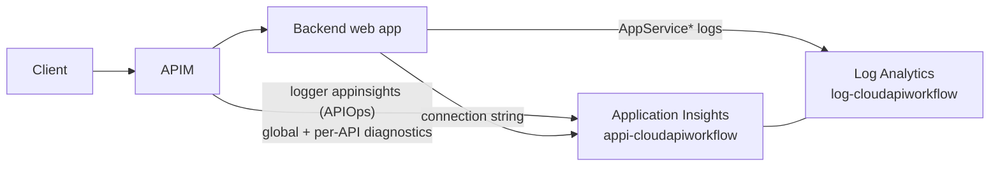

# Operations

## Observability



* The APIOps logger (`loggers/appinsights`) sends every request to Application Insights with W3C correlation; the global policy mints `X-Correlation-Id` when the caller did not send one and echoes it on every response, including errors.
* Global diagnostics at 100 % (dev) / 20 % (prod override); per-API diagnostics can set their own sampling.
* Backend web apps ship HTTP, console, application and **authentication** logs to Log Analytics; the auth logs are where direct-bypass attempts surface.
* Non-Consumption tiers also write `GatewayLogs` through the Terraform diagnostic setting.

## KQL

Requests, status and latency per API (last hour):

```kusto
AppRequests
| where TimeGenerated > ago(1h)
| extend api = tostring(Properties["API Name"]), op = tostring(Properties["Operation Name"])
| summarize requests = count(), p50 = percentile(DurationMs, 50), p95 = percentile(DurationMs, 95),
            s401 = countif(ResultCode == "401"), s403 = countif(ResultCode == "403"),
            s429 = countif(ResultCode == "429"), s5xx = countif(toint(ResultCode) >= 500) by api, op
| order by requests desc
```

Backend latency and failures (APIM → backend dependency calls):

```kusto
AppDependencies
| where TimeGenerated > ago(1h) and DependencyType == "HTTP"
| extend api = tostring(Properties["API Name"])
| summarize backend_p95 = percentile(DurationMs, 95), failures = countif(Success == false) by api, Target
```

Exceptions and gateway errors:

```kusto
AppExceptions | where TimeGenerated > ago(24h) | summarize count() by ProblemId, bin(TimeGenerated, 1h)
```

Follow one correlation id end to end:

```kusto
let cid = "<X-Correlation-Id>";
union AppRequests, AppDependencies, AppTraces
| where TimeGenerated > ago(7d)
| where tostring(Properties["Request-X-Correlation-Id"]) == cid or tostring(Properties["Response-X-Correlation-Id"]) == cid or Message has cid
| project TimeGenerated, Type, Name, ResultCode, DurationMs, Message | order by TimeGenerated asc
```

Direct backend bypass attempts:

```kusto
AppServiceAuthenticationLogs | where TimeGenerated > ago(24h) and StatusCode == 401 | summarize attempts = count() by _ResourceId, bin(TimeGenerated, 1h)
```

## Troubleshooting by status

| status | most likely cause | check |
|---|---|---|
| **401** | no/expired token; wrong audience (`aud` must be `api://<tenant>/cloudapiworkflow-<env>`); wrong tenant | decode the token; compare with the `api-audience` named value; `AppRequests` shows `validate-jwt` errors in `Properties["Reason"]` |
| **403** | token valid but `roles` lacks the operation's role | `az ad sp show` on the client → app role assignments; role names in `terraform.tfvars` `api_app_roles` vs the policy |
| **404** | wrong path or version (`/orders/v1/...`), API not published, operation not in the spec | `az apim api list`; `verify-publish.sh`; the publisher job summary |
| **429** | per-caller `rate-limit-by-key` exceeded | `Retry-After` header; raise `calls` in the API policy via PR if legitimate |
| **500 / 502 / 503** | backend down or rejecting APIM's identity (Easy Auth 401 shows as 500 at the gateway) | `AppDependencies` failures; backend `AppServiceAuthenticationLogs`; confirm `allowedApplications` contains the APIM identity client id |
| **high latency** | backend cold start (B1), Oryx build in progress, App Insights sampling hiding it | `AppDependencies` p95 vs `AppRequests` p95; App Service `always_on`; scale the plan in tfvars |
| **backend unavailable** | deployment in progress, app crashed | `application-deploy` run; `az webapp log tail`; health check path `/health` |

## Runbooks

**API returns 401 with a valid-looking token.** Decode the token (`jwt.ms`), check `aud`, `iss`, `exp`, `roles`. If `aud` is the client id GUID instead of the URI, the token was requested with the wrong scope; use `api://<tenant>/cloudapiworkflow-<env>/.default`.

**Backend returns 401 to APIM.** Easy Auth rejected the gateway identity. Confirm the web app's allowed applications contain the APIM identity **client id** (Terraform output `apim_identity_client_id`) and allowed audiences contain the resource app's identifier URI.

**Publisher failed halfway.** APIOps is idempotent: re-run `apiops-publisher` with `mode=full` to converge, then `apiops-extractor` to confirm no drift.

**Terraform state locked.** Confirm no job is running, then `az storage blob lease break` on the state blob (Blob Data Contributor on the container).

**Rotate the demo client secrets.** `terraform taint time_rotating.demo_client_secret` in `terraform/environments/<env>`, then merge or dispatch `terraform-deploy`.

**Break-glass change in APIM.** See docs/apiops.md; run the extractor within a day so Git catches up.

## Findings from the first live run (2026-09-13)

| symptom | cause | fix |
|---|---|---|
| Backend containers exit with gunicorn "Worker failed to boot", `ImportError: cannot import name 'sentinel' from 'typing_extensions' (/agents/python/common/...)` | the Linux Python App Insights auto-instrumentation agent (`ApplicationInsightsAgent_EXTENSION_VERSION=~3`) prepends its own old `typing_extensions` to the path | agent setting removed from `modules/app-service`; telemetry comes from APIM diagnostics and App Service logs (add the OpenTelemetry SDK in the app if code-level traces are needed) |
| `az webapp deploy` reports failure while Kudu is still building; later `504 GatewayTimeout` from Kudu | Oryx builds on the shared B1 plan take 5-10 minutes and two parallel builds starve Kudu | `--timeout 1500000` on the deploy and `max-parallel: 1` in the matrix |
| Publisher rejects `rate-limit-by-key`, `quota-by-key`, `llm-token-limit`: "Policy is not allowed in 'Consumption' sku" | the Consumption tier has no throttling policies | tree kept Consumption-compatible; 429 test reports "not applicable"; see docs/ai-gateway.md tier parity |
| Publisher rejects the global policy: "Expected a { but found a return" | APIM policy expressions require braces around `if` bodies | braces added |
| terraform-deploy "failed" although apply succeeded: `Resource not accessible by integration` | the job token cannot write repository variables | `.github/actions/platform-context` reads the deployment's outputs artifact; variables are a manual fallback |
| PR plan: `AADSTS700213 No matching federated identity record ... 'repo:owner@id/repo@id:pull_request'` | GitHub issues immutable OIDC subjects with owner and repository ids | bootstrap builds subjects from `github_owner_id` / `github_repository_id` |

## Alerts (prod)

| signal | threshold |
|---|---|
| 5xx ratio per API | > 2 % over 5 min |
| p95 latency per API | > 2 s over 10 min |
| 429 count | > 100 in 5 min |
| Easy Auth 401s on a backend | sustained rate (someone probing the backend directly) |
| Log Analytics daily cap reached | immediately (dev caps at 1 GB/day) |
| drift issue opened | daily `drift-detection` run |

## Cost guards

Log Analytics daily cap in dev; APIM Consumption idles at $0; one B1 plan hosts both backends; per-API diagnostic sampling. Details in [cost.md](cost.md).
