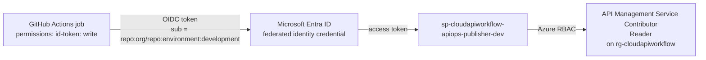

# Security

## Deployment identities: GitHub OIDC, no secrets

| identity | Azure RBAC (dev) | Graph | OIDC subjects |
|---|---|---|---|
| `sp-cloudapiworkflow-platform-<env>` | Contributor + User Access Administrator on `rg-cloudapiworkflow`; Blob Data Contributor on the `platform` state container | Application.ReadWrite.OwnedBy, Application.Read.All, AppRoleAssignment.ReadWrite.All | `environment:<env>`, `pull_request` (dev only) |
| `sp-cloudapiworkflow-apiops-publisher-<env>` | Reader + API Management Service Contributor on the group | none | `environment:<env>` |
| `sp-cloudapiworkflow-apiops-extractor-<env>` | Reader + API Management Service Reader Role | none | `ref:refs/heads/main`, `environment:<env>` |
| demo clients `agent`, `unprivileged` | none (runtime callers) | none | `environment:<env>` |

* No `AZURE_CLIENT_SECRET` and no repository secrets exist. Every identity's only credential is a federated identity credential trusting `https://token.actions.githubusercontent.com` for a specific subject.
* Subjects use GitHub's immutable form `repo:<owner>@<owner_id>/<repo>@<repo_id>:<context>` (the repository default), so a renamed or re-created repository never inherits trust.
* The subject is the boundary. A job only receives an `environment:production` token inside the `production` environment, which requires reviewers. A workflow on a feature branch cannot deploy anywhere, whatever YAML it contains.
* The publisher cannot change the gateway service itself (no Contributor); Terraform's identity cannot publish APIs (it never runs the publisher); the extractor cannot write to Azure at all.
* APIOps tools receive `AZURE_BEARER_TOKEN` from `az account get-access-token` after the OIDC login.

Hardening options documented but not enabled: a dedicated read-only identity for PR plans; subject filters restricted to specific branches; GitHub App tokens for extractor PRs so they trigger CI.

## Runtime: Microsoft Entra ID, OAuth 2.0 client credentials

One resource application per environment, `api://<tenant-id>/cloudapiworkflow-<env>`,
exposes application permissions as app roles (`Skills.Read`, `Orders.Read`,
`Orders.Write`). Clients are service principals granted roles. Tokens are v1
access tokens (`aud` = identifier URI, `iss` = `https://sts.windows.net/<tenant>/`).

APIM enforces, per API, in `apim/artifacts/apis/<api>/policy.xml`:

| check | policy | failure |
|---|---|---|
| signature, expiry, issuer, audience | `validate-jwt` with the tenant's OpenID configuration; audience `{{api-audience}}` | 401 |
| required role for the operation | `choose` on the `roles` claim (GET vs write roles) | 403 with the standard error body |
| per-caller rate | `rate-limit-by-key` keyed by the token subject | 429 + `Retry-After` |

`{{tenant-id}}` and `{{api-audience}}` are named values set per environment
by APIOps; the XML in Git contains no identifiers. The test matrix (no token
401, invalid token 401, valid token without role 403, authorized 200) runs
after every publish with two federated demo clients.

## APIM to backend: managed identity

APIM calls every backend with `<authentication-managed-identity resource="{{api-audience}}" />`,
obtaining a token as its system-assigned identity. The backend web app's
built-in authentication (Easy Auth) is set to `Return401`, validates tokens
for the same resource application, and lists only APIM's identity in
`allowedApplications`. No static backend credential exists anywhere.

## Backend isolation: consumers cannot bypass APIM

**Demo (dev, Consumption tier):** identity-based, works on every tier.
Anything hitting `https://app-<api>-<suffix>.azurewebsites.net` without a
token for the resource app from APIM's identity gets 401 from the platform
before application code runs. Backends are VNet-integrated and the
integration subnet's NSG denies inbound from the Internet. The post-deployment
test asserts the 401.

**Production (prod tfvars):** adds the network layer with the same code:
APIM StandardV2 with outbound VNet integration into `snet-apim`; backends with
`public_network_access_enabled = false` and private endpoints in
`snet-private-endpoints` resolved through `privatelink.azurewebsites.net`;
Key Vault private endpoint; on classic tiers, APIM's static IPs are also
written into the web apps' IP restrictions.

## Managed identity everywhere Azure talks to Azure

| from | to | mechanism |
|---|---|---|
| APIM | backends | system-assigned identity + Easy Auth allow-list |
| APIM | Key Vault | system-assigned identity, Key Vault Secrets User, for the Key Vault-backed named value holding the App Insights connection string |
| backends | Key Vault | system-assigned identity, Key Vault Secrets User |
| backends | Application Insights | connection string app setting written by Terraform from the monitoring module |
| GitHub Actions | Azure, Entra, state storage, APIM | workload identity federation |

The only secrets in the system are the demo clients' local-testing secrets,
generated by Terraform, written straight to Key Vault, rotated every 90 days.

## AI and agents

* The agent runs as the Foundry project's managed identity with read-only app roles; its tool calls are validated by APIM exactly like any client (identity, roles, rate limit) and attributed by `X-Caller-Id`.
* Agent definitions cannot carry hosts, URLs or credentials (`agent-ci` rejects them); tools are built from published contracts with the gateway as the only server.
* A definition pointed at a backend directly gets nothing: backends accept only APIM's identity. `agent-deploy` proves it on every run.
* Model access is Entra-only (`Models.Use`), rate- and token-limited per caller, restricted to an allow-list of deployments; no model key exists (Foundry local auth disabled, APIM uses its identity).
* Prompt injection cannot widen what the agent may do: tools are an allow-list, roles are read-only, quotas bound cost. Prompts and tool payloads are not logged by APIM; Foundry content recording is off.
* Foundry is Entra-only, public endpoint in dev, private endpoint plus network injection in prod. Details: [identity.md](identity.md), [ai-gateway.md](ai-gateway.md), [agentic-architecture.md](agentic-architecture.md).

## Secrets hygiene

* State storage: Entra-only, versioned, soft-deleted, private.
* Tenant and subscription ids are GitHub variables, not files. APIOps overrides hold `{#TOKEN#}` placeholders; real values are rendered in the job.
* `scripts/validate-policy.sh` rejects policies containing GUIDs, backend hostnames or credential-looking strings.
* gitleaks runs on every PR; Trivy scans Terraform for public exposure, missing encryption, weak TLS and excessive RBAC.
* Publisher and extractor never see Key Vault contents; the gateway reads the one secret it needs by identity.
