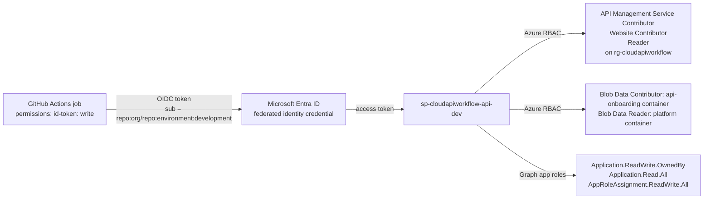

# Security

## Deployment identity: GitHub OIDC, no secrets

* No `AZURE_CLIENT_SECRET` exists anywhere. Every deployer is an app
  registration whose only credential is a federated identity credential
  trusting `https://token.actions.githubusercontent.com`.
* The **subject** is the security boundary. `environment:production` tokens
  are only minted for jobs running inside the `production` GitHub environment,
  which requires reviewers. A workflow on a feature branch cannot obtain one.
* `pull_request` subjects exist only for the dev identities so PRs can plan.
* Identities are per layer and per environment, so the API deployer cannot
  modify the gateway (it has API Management Service Contributor, which manages
  APIs, products, policies inside the service, and Website Contributor for the
  backend web apps; it has no Contributor on the group).

| identity | Azure RBAC (dev) | Graph |
|---|---|---|
| `sp-cloudapiworkflow-platform-dev` | Contributor + User Access Administrator on `rg-cloudapiworkflow`; Blob Data Contributor on `platform` state container | Application.ReadWrite.OwnedBy, Application.Read.All |
| `sp-cloudapiworkflow-api-dev` | Reader, API Management Service Contributor, Website Contributor on `rg-cloudapiworkflow`; Network Contributor on `snet-app-integration` (granted by the platform layer); Blob Data Contributor on `api-onboarding`, Blob Data Reader on `platform` | Application.ReadWrite.OwnedBy, Application.Read.All, AppRoleAssignment.ReadWrite.All |
| `*-prod` | none until `prod_subscription_id` is set in bootstrap | same |

Hardening options documented but not enabled in the demo: a separate
read-only identity for PR plans (Reader + Blob Data Reader only), and
subject filters restricted to specific branches.

## Runtime identity: Microsoft Entra ID, OAuth 2.0 client credentials

Each API is a resource application in Entra:

* identifier URI `api://<tenant-id>/<api-name>-<env>` (the token audience)
* application permissions declared as app roles from `api.yaml`
  (`Skills.Read`, `Orders.Read`, `Orders.Write`, `Customers.Read`)
* v1 access tokens (`aud` = identifier URI, `iss` = `https://sts.windows.net/<tenant>/`)

Clients are service principals granted app roles. The demo agent client
(`cloudapiworkflow-agent-client-<env>`) is granted every role of every API it
is listed under in `allowedClients`. It authenticates with a GitHub federated
credential in CI and, for humans running `scripts/get-token.sh`, a client
secret that lives only in Key Vault.

APIM validates, per API, in `apis/<name>/policies/inbound.xml`:

| check | policy |
|---|---|
| signature and expiry | `validate-jwt` with the tenant's OpenID configuration |
| issuer | `https://sts.windows.net/{{tenant-id}}/` or the v2 issuer |
| audience | the API's identifier URI (or its client id) |
| roles | `required-claims roles match=any` from `requiredRoles`; non-GET requests use `writeRoles` |
| rate | `rate-limit-by-key` keyed by the token subject |

`{{tenant-id}}` is an APIM named value written by the platform; policy files
in Git contain no identifiers.

## Backend isolation: consumers cannot bypass APIM

### Demo (dev, any APIM tier)

Enforced by identity, so it holds on the Consumption tier where APIM has no
VNet or static IP:

1. APIM calls the backend with `<authentication-managed-identity resource="api://<tenant>/<api>-<env>" />`, obtaining a token as its system-assigned identity.
2. The web app's built-in authentication (Easy Auth) is set to `Return401`, validates tokens for the API's own registration, and lists **only APIM's identity** in `allowedApplications`.
3. Anything hitting `https://app-<api>-<suffix>.azurewebsites.net` without that token gets 401 from the platform, before application code runs. The smoke test asserts this.
4. Backend web apps are VNet-integrated; the integration subnet's NSG denies inbound from the Internet.

### Production (prod tfvars)

Adds the network layer:

* APIM StandardV2 with outbound VNet integration into `snet-apim`
* each backend web app `public_network_access_enabled = false` with a private endpoint in `snet-private-endpoints`; `privatelink.azurewebsites.net` resolves it for APIM
* Key Vault private endpoint, public access off
* on classic tiers (Developer/Premium) the module also writes APIM's static IPs into the web apps' IP restrictions

Both configurations are the same code; only `enable_private_endpoints`,
`apim_sku_name` and `apim_vnet_integration` differ.

## Managed identity everywhere Azure talks to Azure

| from | to | mechanism |
|---|---|---|
| APIM | backend web apps | system-assigned identity, `authentication-managed-identity` |
| APIM | Application Insights | logger with connection string set by Terraform (no key in Git) |
| web apps | Application Insights | connection string app setting from platform state |
| GitHub Actions | Azure, Entra, state storage | workload identity federation |
| platform deployer | Key Vault | RBAC Key Vault Secrets Officer, granted by the layer itself |

The only secret in the system is the agent client's local-testing secret. It
is generated by Terraform, written straight to Key Vault, rotated every 90
days by `time_rotating`, and is readable only by principals holding Key Vault
Secrets User.

## Secrets hygiene

* State storage: shared-key access disabled, Entra-only, versioning + soft delete, private container
* Terraform state is never committed (`.gitignore`) and the platform's sensitive outputs are marked `sensitive`
* Tenant and subscription ids come from GitHub variables (`TF_VAR_subscription_id`), not tfvars
* Trivy scans every Terraform change for HIGH/CRITICAL misconfigurations in `platform-ci`
* The Consumption tier's gateway enforces TLS 1.2+; classic tiers additionally disable legacy ciphers through the `security` block
